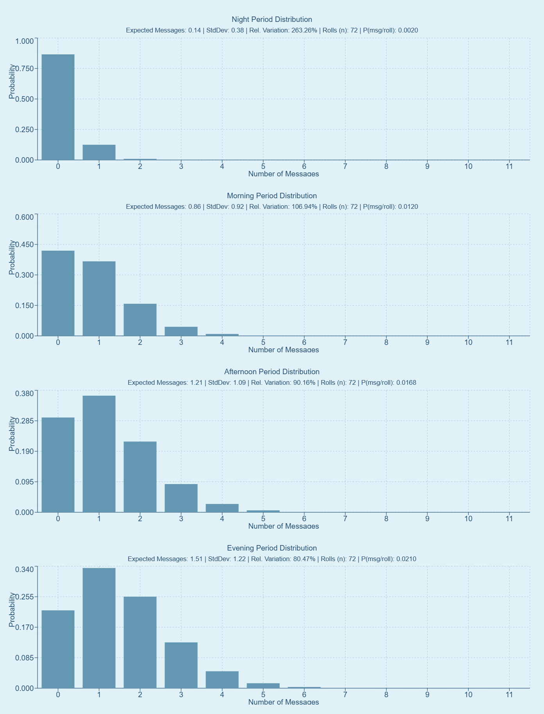

# Unprompted Message Visualizer


A powerful Next.js application that simulates and visualizes how Discord bots send unprompted messages over time. Gain insights into message frequency patterns and probability distributions based on customizable parameters.

## 📊 Project Overview

This tool helps developers and community managers understand and fine-tune their bot's unprompted messaging behavior. The application features two primary visualization modes:

1. **Main Simulation View:** Displays message frequency distribution over time, showing how messages cluster throughout simulated days. Includes statistical insights like mean messages and standard deviation per time bin.

2. **Period Distribution View:** Presents binomial probability distributions for expected message counts across four time periods (Night, Morning, Afternoon, Evening) based on your configuration.



## ✨ Features

### Comprehensive Simulation Controls
* Configure base chance increase rates and roll intervals
* Set custom time period multipliers for different parts of the day
* Adjust simulation duration and time bin granularity
* View instant statistical feedback on parameter changes

### Advanced Visualization
* Interactive charts with detailed tooltips on hover
* Toggle between simulation and probability distribution views
* Real-time calculation updates when parameters change

### Customization & Export
* Choose from six preset themes (Dark, Black, Off-White, Pastel Blue, Pastel Pink, Pastel Green)
* Create and save custom themes with your preferred color palette
* Export visualizations as high-quality JPEG or PNG images

### Technical Foundation
* Robust Python backend handles complex probability calculations
* Efficient Next.js API integration for seamless data flow
* Responsive design works across devices

## 🚀 Getting Started

### Prerequisites
* Node.js (v18.x or later recommended)
* npm, yarn, pnpm, or bun
* Python 3 (accessible via `python3` command in PATH)

### Installation

```bash
# Clone the repository
git clone https://github.com/SR3397/unprompted_viz.git

# Navigate to project directory
cd unprompted_viz

# Install dependencies
npm install

# Start the development server
npm run dev
```

Open [http://localhost:3000](http://localhost:3000) in your browser to use the application.

## 🧩 How It Works

The application follows a streamlined process flow:

1. **Configuration:** Set parameters through the intuitive UI
2. **Calculation Request:** Frontend sends parameters to the Next.js API route (`/api/simulate`)
3. **Simulation:** Python backend (`src/lib/simulation.py`) processes the request using:
   - Monte Carlo simulation for the main view
   - Binomial probability calculations for the period distributions
4. **Visualization:** Results are rendered using Recharts with your selected theme

### Core Configuration Parameters

| Parameter | Description |
|-----------|-------------|
| `UNPROMPTED_CHANCE_BUILD_AMOUNT` | Base percentage points for message chance increase |
| `UNPROMPTED_ROLL_INTERVAL_SECONDS` | Frequency of message opportunity checks |
| `UNPROMPTED_CHANCE_BUILD_INTERVAL_SECONDS` | How often chance accumulates |
| `unpromptedTimePeriods_multipliers` | Time-specific modifiers for each period |

## 🎨 Customizing Themes

Create your perfect visualization style:

1. Select any existing theme from the dropdown menu
2. Click "Customize Theme" to open the editor
3. Adjust colors and provide a unique theme name
4. Save your theme to browser local storage for future use
5. Apply or delete custom themes as needed

## 📂 Project Structure

```
unprompted_viz/
├── src/
│   ├── app/
│   │   ├── page.tsx          # Main UI component and application logic
│   │   └── api/simulate/     # API endpoint for simulation requests
│   ├── components/           # Reusable React components for charts
│   └── lib/
│       └── simulation.py     # Core Python simulation logic
└── public/                   # Static assets
```

## 📝 License

This project is licensed under the MIT License - see the LICENSE file for details.

---

Developed with ❤️ for Discord bot enthusiasts and data visualization lovers.